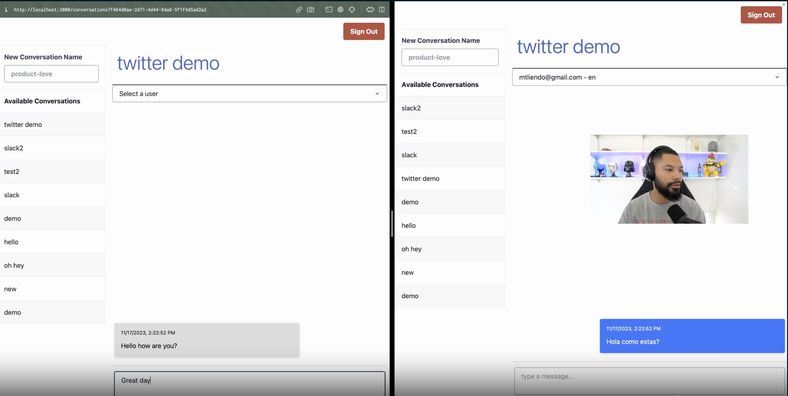
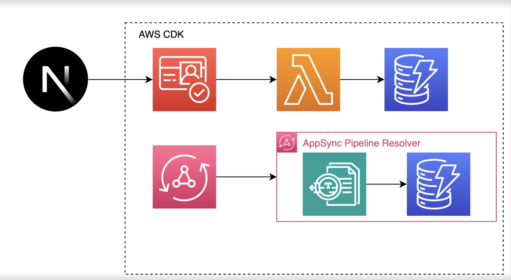

# AppSync Realtime Chat Translator

[Related AWS Blog post](https://aws.amazon.com/blogs/mobile/connecting-applications-to-generative-ai-presents-new-challenges/)



## Overview

AppSync Realtime Chat Translator is an innovative chat application that leverages the power of AWS services to provide a seamless real-time chat experience with built-in translation capabilities. This application is ideal for users seeking to communicate across language barriers effortlessly. It integrates [AWS AppSync](https://aws.amazon.com/appsync/), Amazon Cognito, [Amazon Translate](https://aws.amazon.com/translate/), and DynamoDB, along with a React frontend using NextJS.



## Features

- **Real-Time Chat:** Utilizes AWS AppSync for efficient, real-time data synchronization.
- **Automatic Translation:** Integrates Amazon Translate for real-time language translation in chat.
- **User Authentication:** Securely manages user authentication and authorization using Amazon Cognito.
- **Data Storage:** Leverages DynamoDB for scalable and reliable data storage.
- **Seamless UI Experience:** Employs AWS Amplify UI libraries for a user-friendly interface.
- **Language Preference:** Users can set their preferred language for receiving messages.
- **Cross-Language Communication:** Allows users to chat in different languages with automatic translation.

## Getting Started

### Prerequisites

- Node.js and npm
- AWS account and AWS CLI configured

### Installation

1. **Clone the Repository:**

2. **Install Dependencies:**

   ```bash
   cd AppSync-Realtime-Chat-Translator
   npm install && cd _cdk-backend && npm install
   ```

3. **Deploy the Backend:**

   - The backend is managed using AWS CDK.
   - Navigate to the backend directory and deploy using provided NPM script:
     `npm run deploy`

4. **Run the Application:**

- While in the frontend directory run the following

```bash
npm run dev
```

## Usage

- **Sign Up and Authentication:**
  - New users can sign up using their email.
  - A post-confirmation trigger adds the new user to the User table.
- **Set Language Preference:**
  - After signing up, users specify their preferred language.
- **Start Chatting:**
  - Users can initiate a chat with another user.
  - Incoming messages are automatically translated to the user's preferred language.
  - Outgoing messages are translated into the recipient's preferred language.

## Architecture

- **Frontend:** React application with NextJS.
- **Backend:** AWS CDK to create and manage AWS resources.
- **Services Used:**
  - AWS AppSync for real-time data handling.
  - Amazon Cognito for user authentication.
  - Amazon Translate for message translation.
  - DynamoDB for data storage.
  - AWS Amplify UI for frontend development.
